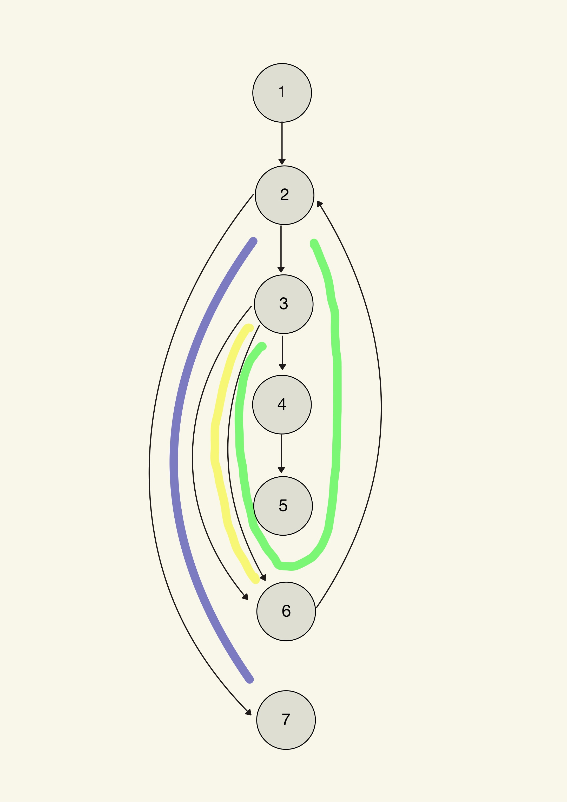
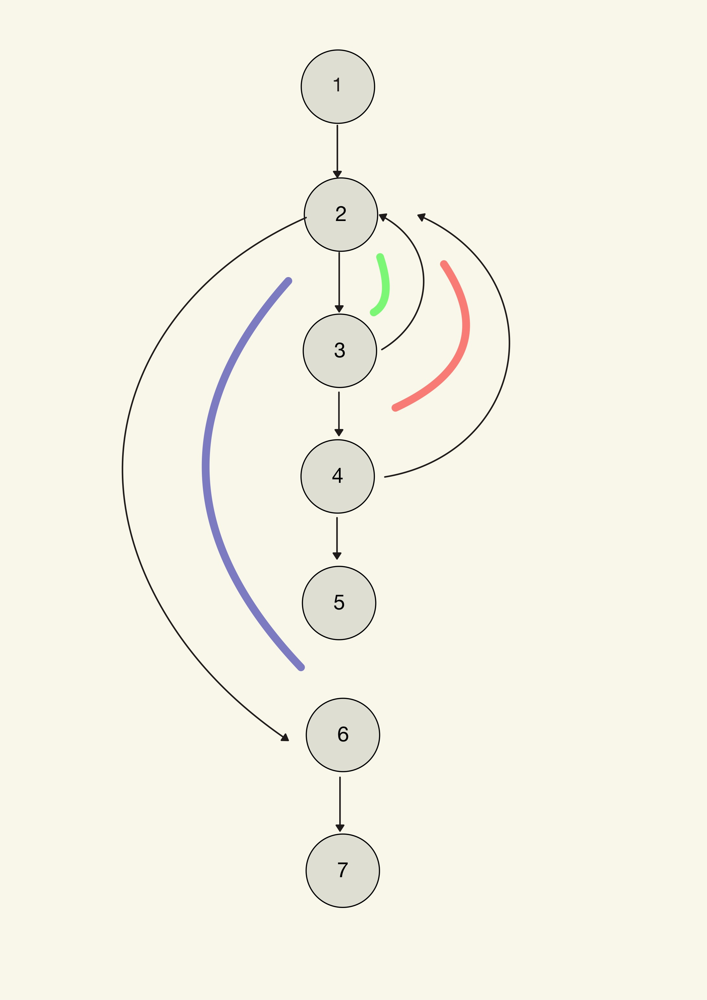
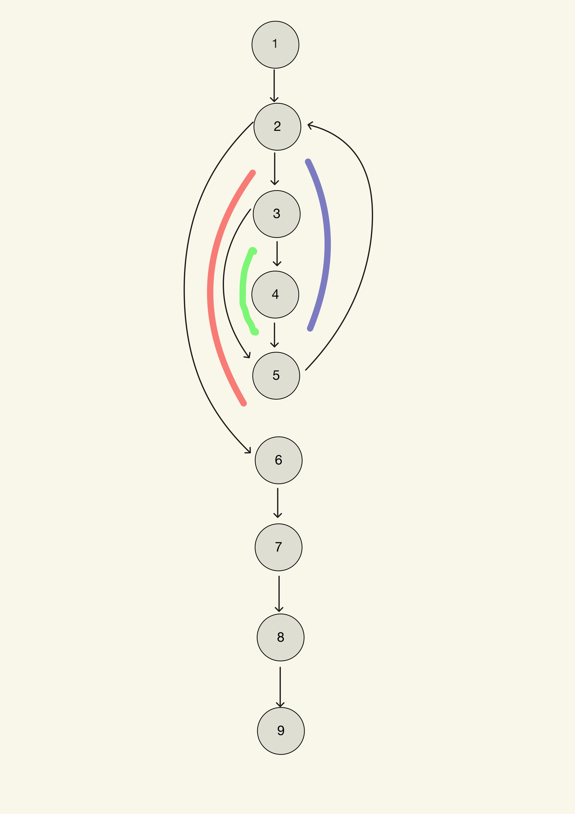

# <span style='color:blue'> **ESI-Escape** </span> 

***

[comment]:<> "Los tres asteriscos añaden una línea horizontal"

## Índice 
1. [Introducción](#introducción)

2. [Documentación de usuario](#usuario)
   - [Descripción funcional](#funcional)
   - [Tecnologías](#tecnología)
   - [Instalación](#instalación)
   - [Acceso al sistema](#acceso)
   - [Manual de referencia](#referencia)
   - [Guía del operador](#operador)
   
3. [Documentación del sistema](#sistema)
   - [Especificación del sistema](#requisitos)
   - [Módulos](#módulos)
   - [Plan de pruebas](#pruebas)  

4. [Documentación del código fuente](#codigo)

***

<div id='introducción' />

## 1. Introducción

El presente documento detalla la arquitectura, el funcionamiento y el manual de uso del proyecto **ESI-Escape**, desarrollado para la asignatura de Metodología de la Programación. 

El proyecto consiste en un videojuego de aventura conversacional (basado en texto) en el cual el usuario debe escapar de la Escuela Superior de Ingeniería. Para lograrlo, el jugador deberá explorar un mapa interconectado de 30 salas, recolectar objetos, gestionar su inventario y resolver una serie de enigmas lógicos. 

A nivel técnico, el motor del juego está desarrollado íntegramente en lenguaje C. Hace un uso intensivo de la lectura segura de ficheros de texto plano para estructurar la base de datos del juego y emplea asignación de memoria dinámica adaptativa (`malloc`, `realloc`) para cargar la configuración de la partida en tiempo real, garantizando un rendimiento óptimo y un diseño modular.

<div id='usuario' />

# 2. Documentación de usuario

Esta sección está orientada a las personas que van a usar el sistema, describiendo sus funciones principales sin entrar en detalles de programación o implementación interna.

<div id='funcional' />

## Descripción funcional

**ESI-Escape** es un sistema de entretenimiento interactivo mediante consola de comandos. Su propósito es ofrecer una experiencia de "Escape Room" narrativa y lógica.

* **Qué hace el sistema:** * Permite la creación de perfiles de usuario únicos (con nombre, usuario y contraseña) para jugar de forma individualizada.
  * Autentica a los jugadores recurrentes comparando sus credenciales con una base de datos local.
  * Permite al usuario navegar por un entorno virtual de 30 salas, examinar su alrededor, recoger objetos y guardarlos en un inventario persistente.
  * Exige el uso de objetos específicos para abrir accesos bloqueados y la resolución de puzles (introduciendo códigos o palabras clave) para poder avanzar.
  * Guarda automáticamente el progreso de múltiples jugadores de forma simultánea, permitiendo retomar la partida exactamente en la misma sala y con los mismos objetos.

* **Qué NO hace el sistema:** * El juego no cuenta con una interfaz gráfica interactiva (GUI) basada en ratón.
  * No procesa ni renderiza elementos visuales 2D/3D o audio. Toda la interacción y la narrativa son estrictamente textuales.

<div id='tecnología' />

## Tecnología

Las tecnologías, lenguajes y librerías empleadas en el desarrollo de este proyecto son las siguientes:

* **Lenguaje base:** C (Estándar C99 / C11).
* **Entorno de desarrollo:** [VSCode](https://code.visualstudio.com/) y [Codeblocks](https://www.codeblocks.org/)
* **Compilador:** [GCC](https://gcc.gnu.org/)
* **Control de versiones:** [Git](http://git-scm.com/)
* **Gestión de Memoria:** Uso de las funciones estándar `malloc`, `realloc` y `free` de la librería `<stdlib.h>` para la creación de estructuras dinámicas en tiempo de ejecución.
* **Persistencia de Datos:** Manejo de ficheros de texto plano (`.txt`) mediante las funciones de la librería `<stdio.h>`.

<div id='instalación' />

## Instalación

Para poner en funcionamiento el sistema **ESI-Escape**, es necesario contar con un entorno de desarrollo para lenguaje C y seguir los pasos de compilación descritos a continuación.

### Requisitos previos
* **Compilador:** GCC (GNU Compiler Collection) o cualquier compilador compatible con el estándar C99/C11.
* **Archivos de datos:** El ejecutable debe residir en la misma carpeta que los archivos de configuración `.txt` (`Salas.txt`, `Objetos.txt`, `Conexiones.txt`, `Puzles.txt` y `Jugadores.txt`).

### Proceso de compilación
Desde la terminal o consola de comandos, ejecute la siguiente instrucción para compilar todos los módulos del proyecto:

```bash
gcc main.c memoria.c menu.c acciones.c -o ESI-Escape
```

### Ejecución
Una vez compilado, el sistema se inicia mediante el comando:

En Windows: ```ESI-Escape.exe ```

En Linux/macOS: ```./ESI-Escape```

<div id='acceso' />

### Acceso al sistema
El sistema cuenta con un módulo de gestión de usuarios que permite tanto el registro de nuevos jugadores como la autenticación de usuarios existentes.

Registro de nuevos usuarios
Si es la primera vez que se accede, el usuario debe seleccionar la opción `"2. Registrarse"` en el menú principal. El sistema solicitará:

Nombre de usuario: Un identificador único de hasta 10 caracteres.

Nombre/Apodo: Nombre descriptivo de hasta 20 caracteres (permite espacios).

Contraseña: Una clave de acceso de hasta 8 caracteres.

Inicio de sesión
Para acceder a una partida, el usuario debe elegir `"1. Iniciar Sesion"` e introducir sus credenciales. El sistema verificará la coincidencia exacta en el archivo Jugadores.txt. En caso de éxito, se cargará la identidad del jugador en la estructura dinámica jugador_actual.

<div id='referencia' />

### Manual de referencia
Esta sección detalla las funciones principales que componen el motor del juego, organizadas por su responsabilidad técnica.

#### Gestión de Memoria y Persistencia (memoria.c)
cargarDatosMemoria(Partida *estado): Lee secuencialmente los archivos de configuración y utiliza realloc para construir el mapa y los objetos en RAM de forma dinámica.

guardarDatosFicheros(Partida *estado): Implementa un guardado seguro. Crea un archivo Temp.txt, clona la información de otros jugadores y actualiza únicamente el progreso del jugador activo para evitar la corrupción de datos ajenos.

liberarDatosMemoria(Partida *estado): Garantiza la ausencia de fugas de memoria (memory leaks) liberando todos los punteros dinámicos al finalizar el programa.

#### Lógica de Juego e Interacción (acciones.c)
entrar_sala(Partida *estado): Valida si existe una conexión entre la sala actual y el destino solicitado, comprobando si el estado de dicha conexión es "Activa".

usar_objeto(Partida *estado): Comprueba si un objeto del inventario coincide con la "Condicion" de una conexión bloqueada para activarla.

resolver(Partida *estado): Gestiona la interacción con puzles. Compara la entrada del usuario con la solución almacenada en la estructura del puzle asociado a una conexión.

#### Interfaz y Control (menu.c)
mostrar_menu_principal(Partida *estado): Controla el flujo inicial del programa y gestiona la limpieza del buffer de entrada para evitar errores de lectura.

<div id='operador' />

### Guía del operador
Una vez iniciada la sesión, el jugador dispone de un menú de 10 opciones para interactuar con el mundo de ESI-Escape.

#### Comandos de Exploración
Describir sala (1): Muestra el nombre y la ambientación de la sala actual. Es fundamental para detectar si se ha llegado a la "SALIDA".

Examinar (2): Lista todos los objetos presentes en el suelo y las direcciones (conexiones) disponibles, indicando si están bloqueadas.

Inventario (6): Muestra los objetos que el jugador transporta actualmente y su descripción detallada.

#### Comandos de Acción
Moverse (3): Permite desplazarse a una sala adyacente introduciendo su número de ID, siempre que el camino no esté bloqueado.

Coger/Soltar objeto (4, 5): Permite recoger elementos del entorno para llevarlos en el inventario o dejarlos en la sala actual.

Interactuar (7, 8): Se utiliza para aplicar objetos sobre el entorno o introducir códigos en paneles para desbloquear nuevas zonas.

#### Gestión de Partida
Guardar (9): Almacena el ID de la sala actual, los objetos en posesión y las conexiones desbloqueadas en el archivo de persistencia.

Volver (10): Permite salir de la partida actual al menú principal. El sistema solicitará una confirmación de seguridad para evitar la pérdida de progreso no guardado.

<div id='sistema' />

# 3. Documentación del sistema
Esta sección hace referencia a los aspectos del análisis, diseño, implementación y prueba del software, estando orientada a los programadores que vayan a realizar el mantenimiento del sistema.

<div id='requisitos' />

## Especificación del sistema

El programa requiere la gestión concurrente de múltiples entidades relacionales. El problema principal se ha descompuesto en subproblemas gestionados mediante estructuras (`structs`) anidadas: Salas, Conexiones, Objetos, Puzles y Jugadores.

Para gestionar la variabilidad del tamaño del mapa o la cantidad de objetos, el sistema no utiliza vectores estáticos, sino que lee las entidades de los ficheros de texto y solicita memoria dinámica de manera adaptativa utilizando la función `realloc()`. Esto evita el desbordamiento estático y genera un entorno completamente funcional independientemente de la envergadura de la base de datos inicial. El estado global del juego se encapsula en un único supernodo dinámico denominado `Partida`.

```c
Estructura principal que encapsula el estado global del juego
typedef struct {
    Jugadores *jugadores;
    int num_jugadores;
    Salas *salas;
    int num_salas;
    Objetos *objetos;
    int num_objetos;
    Conexiones *conexiones;
    int num_conexiones;
    Puzles *puzles;
    int num_puzles;
    int sala_actual_id;      
    Jugadores *jugador_actual; 
} Partida;
```


<div id='módulos' />

## Módulos

El proyecto aplica una fuerte separación de responsabilidades, dividiéndose en los siguientes módulos:

* **`Menú`:** Gestiona la interacción directa con el usuario y el control de acceso al sistema.
Seguridad y Acceso: Implementa iniciar_sesion y registrar_jugador, manejando la lectura/escritura de credenciales en Jugadores.txt.
Robustez: Controla la entrada por teclado, empleando escudos contra datos no numéricos para evitar fallos en la navegación de los menús.
Orquestación: Sirve de puente hacia el menú del juego una vez que el usuario ha sido autenticado con éxito.
```c
void mostrar_menu_principal(Partida *estado) {
    int opcion;
    do {
        printf("\n=========================\n");
        printf("   Bienvenido al juego   \n");
        printf("       ESI ESCAPE        \n");
        printf("=========================\n");
        printf("1. Iniciar Sesion\n");
        printf("2. Registrarse\n");
        printf("3. Salir\n");
        printf("Elige una opcion: ");
        
        if (scanf("%d", &opcion) != 1) {
            while (getchar() != '\n');
            opcion = 0;
        }

        switch(opcion) {
            case 1:
                // Si el inicio de sesión devuelve 1 (Éxito), entramos al submenú
                if (iniciar_sesion(estado)) {
                    menu_de_partida(estado);
                }
                break;
            case 2:
                registrar_jugador(estado); 
                break;
            case 3:
                printf("\nSaliendo del juego... ¡Hasta la proxima!\n");
                break;
            default:
                printf("\nOpcion no valida. Intentalo de nuevo.\n");
        }
    } while (opcion != 3);
}
```
* **`Memoria`:** Se encarga de la capa de abstracción de datos y la gestión del ciclo de vida de la memoria dinámica.
Carga Dinámica: Implementa cargarDatosMemoria, que utiliza realloc para construir el mapa de juego de forma adaptativa según el contenido de los archivos .txt.
Persistencia Segura: La función guardarDatosFicheros garantiza que el progreso se guarde sin afectar a otros usuarios mediante un archivo temporal.
Limpieza: Provee liberarDatosMemoria para asegurar que el sistema no deje basura en la RAM al finalizar.
```c
// Funciones para volcar información de ficheros a memoria dinámica
void cargarDatosMemoria(Partida *Estado);
void guardarDatosFicheros(Partida *Estado);
void liberarDatosMemoria(Partida *Estado);
```
* **`Acciones`:** Contiene el "motor de reglas" del juego. Traduce las intenciones del jugador en cambios en el estado de la partida.
Mecánicas de Juego: Gestiona funciones como entrar_sala, coger_objeto y usar_objeto.
Resolución de Enigmas: La función resolver actúa como el evaluador de puzles, comparando cadenas de texto para desbloquear nuevas zonas.
Interacción Narrativa: Provee la función describir, encargada de detectar la condición de victoria si el jugador alcanza una sala de tipo "SALIDA".
```c
// Subacciones
void describir(Partida *estado);
void examinar(Partida *estado);
void entrar_sala(Partida *estado);
void coger_objeto(Partida *estado);
void soltar_objeto(Partida *estado);
void inventario(Partida *estado);
void usar_objeto(Partida *estado);
void resolver(Partida *estado);
void guardar_partida(Partida *estado);
```
* **`Ficheros`:** Este módulo actúa como el núcleo estructural del proyecto. A diferencia de los demás, no contiene lógica ejecutable (funciones), sino que define las estructuras de datos (`structs`) que modelan todas las entidades del universo de **ESI-Escape**.
```c
// Estructura que centraliza el estado global en tiempo de ejecución
typedef struct {
    Jugadores *jugadores;
    int num_jugadores;
    Salas *salas;
    int num_salas;
    Objetos *objetos;
    int num_objetos;
    Conexiones *conexiones;
    int num_conexiones;
    Puzles *puzles;
    int num_puzles;
    int sala_actual_id;      
    Jugadores *jugador_actual; 
} Partida;
```

<div id='pruebas' />

## Plan de prueba

Para asegurar la calidad y estabilidad del software, se han llevado a cabo las siguientes comprobaciones:

### Prueba de los módulos
* **Prueba de robustez de entrada (Caja negra):** 
En esta sección se aplican las técnicas de diseño de casos de prueba de caja negra, centrándonos en las indicaciones teóricas: **valores límite**, **valores lógicos** (falso/verdadero) y **pertenencia a conjuntos** (valores que pertenecen y no pertenecen).

## Módulo 1: `fichero.c`

### 1. Función `contarLineas`
Técnica aplicada: **Valores Límite** (basado en la condición de longitud estricta `> 2`).

| ID | Descripción / Técnica | Datos de Entrada Simulados | Resultado Esperado |
| :--- | :--- | :--- | :--- |
| **CP-F01** | **Lógico (Falso):** Archivo no existe | `nombreFichero = "falso.txt"` | Retorna `0` |
| **CP-F02** | **Límite Inferior:** 0 bytes | Fichero vacío | Retorna `0` |
| **CP-F03** | **Límite Inferior:** Línea corta | Fichero con 1 línea: `"A\n"` (2 caracteres) | Retorna `0` |
| **CP-F04** | **Límite Superior:** Línea válida | Fichero con 1 línea: `"Hola\n"` (5 caracteres) | Retorna `1` |

### 2. Función `cargarSalas` (y afines)
Técnica aplicada: **Conjuntos** (estructura de datos delimitada por guiones).

| ID | Descripción / Técnica | Datos de Entrada (`Salas.txt`) | Resultado Esperado |
| :--- | :--- | :--- | :--- |
| **CP-F05** | **No pertenece al conjunto:** Fichero faltante | Archivo borrado o renombrado | `num_salas = 0`, no reserva memoria |
| **CP-F06** | **Pertenece al conjunto:** Formato correcto | `1-Cocina-INICIAL-Oscura` | `id_sala = 1`, `nomb_sala = "Cocina"`, `tipo = "INICIAL"` |
| **CP-F07** | **No pertenece al conjunto:** Faltan datos | `2-Baño-NORMAL` (Falta descripción) | Maneja el `NULL` del `strtok` sin colapsar |

---

## Módulo 2: `memoria.c`

### 1. Función `cargarDatosMemoria`
Técnica aplicada: **Valores Lógicos y Conjuntos**.

| ID | Descripción / Técnica | Datos de Entrada Simulados | Resultado Esperado |
| :--- | :--- | :--- | :--- |
| **CP-M01** | **Lógico (Falso):** Archivos faltantes | No existe `Salas.txt` en el directorio. | Imprime mensaje de error y deja punteros limpios (`NULL`). |
| **CP-M02** | **Conjunto (Pertenencia):** Tipo de sala | `Salas.txt` tiene una sala `"NORMAL"` y otra `"INICIAL"`. | `estado->sala_actual_id` toma el ID de la sala `"INICIAL"`. |
| **CP-M03** | **Lógico (Falso):** Líneas en blanco | `Conexiones.txt` tiene saltos de línea vacíos. | El sistema ignora las líneas cortas y no colapsa. |

### 2. Función `guardarDatosFicheros`
Técnica aplicada: **Valores Lógicos y Pertenencia a Conjuntos** (filtrado de datos a guardar).

| ID | Descripción / Técnica | Estado en Memoria (RAM) | Resultado Esperado (`Partida.txt`) |
| :--- | :--- | :--- | :--- |
| **CP-M04** | **Lógico (Falso):** Sin jugador activo | `estado->jugador_actual = NULL` | Muestra error *"No hay un jugador activo"* y aborta el guardado. |
| **CP-M05** | **Conjunto:** Inventario | 1 objeto `"Inventario"` y 1 en sala `"12"`. | Solo guarda la línea `OBJETO:` del que pertenece a `"Inventario"`. |
| **CP-M06** | **Conjunto:** Conexiones | 1 conexión `"Activa"` y 1 `"Bloqueada"`. | Solo guarda la conexión que pertenece al estado `"Activa"`. |

### 3. Función `liberarDatosMemoria`
Técnica aplicada: **Valores lógicos** (punteros).

| ID | Descripción / Técnica | Estado en Memoria (RAM) | Resultado Esperado |
| :--- | :--- | :--- | :--- |
| **CP-M07** | **Lógico (Falso):** Punteros ya nulos | Todos los vectores del `estado` valen `NULL`. | Detecta el `NULL`, no ejecuta `free()` y evita *Segmentation Fault*. |
| **CP-M08** | **Lógico (Verdadero):** Punteros ocupados | Se ejecutó `cargarDatosMemoria` previamente. | Ejecuta `free()` en todos los vectores y los iguala a `NULL`. |

# Diseño de Casos de Prueba: Caja Negra
## Módulo: `fichero.c`

En esta sección se aplican las técnicas de diseño de casos de prueba de caja negra para las funciones de lectura y carga de ficheros. Se utilizan las estrategias de **valores lógicos** (verdadero/falso), **pertenencia a conjuntos** y **valores límite**.

### 1. Función `contarLineas(const char *nombreFichero)`
Esta función cuenta las líneas de un fichero que superan los 2 caracteres de longitud.
* **Técnicas aplicadas:** Valores lógicos (apertura de fichero) y Valores Límite (longitud de la cadena `> 2`).

| ID | Descripción / Técnica | Datos de Entrada Simulados | Resultado Esperado |
| :--- | :--- | :--- | :--- |
| **CP-F01** | **Valor Lógico (Falso):** Fallo al abrir | `nombreFichero = "no_existe.txt"` | La función retorna `0`. |
| **CP-F02** | **Valor Límite (Inferior):** Fichero vacío | Fichero en disco con 0 bytes. | La función retorna `0`. |
| **CP-F03** | **Valor Límite (Justo en el límite):** No cumple | Fichero con 1 línea de 2 caracteres: `"A\n"` | La función ignora la línea y retorna `0`. |
| **CP-F04** | **Valor Límite (Por encima):** Sí cumple | Fichero con 1 línea de 3 caracteres: `"Hi\n"` | La función cuenta la línea y retorna `1`. |

### 2. Función `cargarSalas(EstadoJuego *estado)`
Esta función abre `Salas.txt`, reserva memoria y extrae los datos delimitados por guiones (`-`).
* **Técnicas aplicadas:** Valores lógicos (existencia de fichero/punteros) y Pertenencia a Conjuntos (formato válido de tokens).

| ID | Descripción / Técnica | Datos de Entrada (`Salas.txt`) | Resultado Esperado |
| :--- | :--- | :--- | :--- |
| **CP-F05** | **Valor Lógico (Falso):** Archivo ausente | El archivo `Salas.txt` no existe. | `estado->num_salas` es `0`, la función hace `return` sin fallar. |
| **CP-F06** | **Conjunto (Pertenece):** Formato correcto | Línea: `1-Cocina-INICIAL-Habitacion oscura` | `strtok` extrae correctamente: `id=1`, `nombre="Cocina"`, `tipo="INICIAL"`. |
| **CP-F07** | **Conjunto (No pertenece):** Faltan tokens | Línea incompleta: `2-Baño-NORMAL` | La función maneja el retorno `NULL` de `strtok` sin generar *Segmentation Fault*. |

### 3. Funciones `cargarObjetos` / `cargarConexiones` / `cargarPuzles`
Dado que utilizan la misma lógica de partición de cadenas (`strtok` con delimitador `-`) que `cargarSalas`, se agrupan las pruebas de integración de formato.
* **Técnicas aplicadas:** Pertenencia a Conjuntos (datos esperados según la estructura).

| ID | Descripción / Técnica | Datos de Entrada Simulados | Resultado Esperado |
| :--- | :--- | :--- | :--- |
| **CP-F08** | **Conjunto (Pertenece):** Objeto válido | `Objetos.txt` línea: `001-Llave-Abre puertas-Inventario` | El objeto se almacena correctamente en `estado->objetos`. |
| **CP-F09** | **Conjunto (Pertenece):** Conexión válida | `Conexiones.txt` línea: `C01-1-2-Activa-0` | Los IDs `1` y `2` se convierten a enteros (`atoi`) y se guarda el estado `"Activa"`. |
| **CP-F10** | **Conjunto (No pertenece):** Tipo de dato erróneo | `Conexiones.txt` línea: `C01-A-B-Activa-0` (Letras en lugar de números para IDs) | `atoi` devuelve `0`, asignando un ID de sala inexistente pero sin romper la ejecución. |

### 4. Función integradora (Ej: `cargarDatosMemoria` si está en fichero.c)
Verifica la inicialización correcta de la memoria dinámica para todo el sistema.
* **Técnicas aplicadas:** Valores lógicos combinados.

| ID | Descripción / Técnica | Estado Inicial | Resultado Esperado |
| :--- | :--- | :--- | :--- |
| **CP-F11** | **Valores Lógicos (Verdadero):** Carga total | Todos los ficheros `.txt` existen y tienen datos. | Se reserva memoria dinámica correctamente y se imprime el mensaje de éxito de carga. |

* **Prueba de ruta básica (Función `iniciar_sesion`)**: 
#### Detalle de Prueba de Ruta Básica (Miembro: Juan Carlos Cáceres)
Código:
```c
int iniciar_sesion(Partida *estado) {
    // (1) Apertura de fichero y preparación
    FILE *f = fopen("Jugadores.txt", "r");
    if (f == NULL) return 0; 

    // (2) Bucle de lectura de líneas
    while (fgets(linea, sizeof(linea), f)) {
        
        // (3) Nodo Predicado: ¿Se han extraído todos los tokens?
        if (user_txt != NULL && pass_txt != NULL) {
            
            // (4) Nodo Predicado: ¿Coinciden usuario y contraseña?
            if (strcmp(user_txt, input) == 0 && strcmp(pass_txt, input) == 0) {
                // (5) Bloque de éxito: Reserva de memoria y retorno
                return 1; 
            }
        }
        // (6) Fin de iteración (vuelve al nodo 2)
    }
    // (7) Cierre de fichero y retorno de fallo
    fclose(f);
    return 0;
}
```

Se aplica la técnica de Caja Blanca sobre la función `iniciar_sesion` para garantizar que todos los flujos de control (éxito, fallo y archivos vacíos) son ejecutados correctamente.

**A. Grafo de Flujo de Control (CFG) y Nodos**
Para el análisis, se han identificado los siguientes nodos lógicos en el código:
* **(1)** Apertura del fichero `Jugadores.txt`.
* **(2)** Nodo Predicado: Condición del bucle `while (fgets...)`.
* **(3)** Nodo Predicado: Comprobación de tokens válidos (`user_txt != NULL`).
* **(4)** Nodo Predicado: Comparación de credenciales (`strcmp == 0`).
* **(5)** Nodo de Éxito: Reserva de memoria (`malloc`) y retorno de 1.
* **(6)** Fin de iteración del bucle.
* **(7)** Nodo de Salida: Cierre de fichero y retorno de 0.

**B. Complejidad Ciclomática $V(G)$**
Calculada mediante los tres métodos estándar:
1.  **Regiones**: El grafo presenta 4 regiones (3 cerradas y 1 abierta).
2.  **Nodos Predicado**: $V(G) = 3 \text{ nodos predicado} + 1 = 4$.
3.  **Aristas y Nodos**: $V(G) = 10 \text{ aristas} - 8 \text{ nodos} + 2 = 4$.

**C. Conjunto de Rutas Linealmente Independientes**
Se han definido 4 rutas que cubren la totalidad del grafo:
* **Ruta 1 (Fallo Apertura/Vacío)**: $1 - 2 - 7$
* **Ruta 2 (Línea Corrupta)**: $1 - 2 - 3 - 6 - 2 - 7$
* **Ruta 3 (Usuario Incorrecto)**: $1 - 2 - 3 - 4 - 6 - 2 - 7$
* **Ruta 4 (Éxito de Login)**: $1 - 2 - 3 - 4 - 5$

**D. Casos de Prueba (Entradas y Salidas)**
| ID Caso | Descripción | Entrada Fichero | Entrada Teclado | Resultado Esperado |
| :--- | :--- | :--- | :--- | :--- |
| **CP-RB-01** | Fichero inexistente | N/A | `admin / 123` | `return 0` |
| **CP-RB-02** | Formato incorrecto | `01-Paco-paco` | `paco / 123` | `return 0` |
| **CP-RB-03** | Credenciales mal | `01-Paco-paco-123` | `paco / 999` | `return 0` |
| **CP-RB-04** | Acceso correcto | `01-Paco-paco-123` | `paco / 123` | `return 1` |



* **Prueba de ruta básica (Función `soltar_objeto`)**: 
#### Detalle de Prueba de Ruta Básica (Miembro: Carlos Márquez Sánchez)
Código:
```c
void soltar_objeto(Partida *estado) {
    char id_buscado[5];
    printf("\n--- SOLTAR OBJETO ---\n");
    printf("Introduce el ID del objeto a soltar: ");
    scanf("%4s", id_buscado);

    for (int i = 0; i < estado->num_objetos; i++) {
        if (strcmp(estado->objetos[i].Id_obj, id_buscado) == 0) {
            // Comprobar que realmente lo tiene en el inventario
            if (strcmp(estado->objetos[i].Localiz, "Inventario") == 0) {
                // Cambiar la localización al ID de la sala actual
                sprintf(estado->objetos[i].Localiz, "%02d", estado->sala_actual_id);
                printf("Has soltado: %s en la sala.\n", estado->objetos[i].Nomb_obj);
                return;
            }
        }
    }
    printf("No tienes ese objeto en tu inventario.\n");
}
```

Se aplica la técnica de Caja Blanca sobre la función `soltar_objeto` para verificar el correcto flujo de salida de objetos del inventario hacia las salas.

**A. Grafo de Flujo de Control (CFG)**
* **(1)** Entrada a la función y lectura del ID del objeto por teclado.
* **(2)** Nodo Predicado: Condición del bucle for (recorrido del vector de objetos).
* **(3)** Nodo Predicado: Comparación del ID buscado con el ID del objeto actual (strcmp == 0).
* **(4)** Nodo Predicado: Verificación de posesión (Localizacion == "Inventario").
* **(5)** Nodo de Éxito: Cambio de localización a la sala actual y retorno de 1.
* **(6)** Fin de iteración del bucle (incremento del índice).
* **(7)** Nodo de Salida: Mensaje de "Objeto no encontrado" y retorno de 0.

**B. Descripción de los Nodos**
Se han identificado los siguientes nodos lógicos basados en el flujo de ejecución de la función en `acciones.c`:
* **Nodo 1**: Entrada a la función, impresión de cabecera y lectura del ID del objeto por teclado (`scanf`).
* **Nodo 2 (Nodo Predicado)**: Condición de salida del bucle `for` que recorre el vector de objetos (`i < num_objetos`).
* **Nodo 3 (Nodo Predicado)**: Primer `if` que comprueba si el ID del objeto en la posición `i` coincide con el buscado (`strcmp == 0`).
* **Nodo 4 (Nodo Predicado)**: Segundo `if` que verifica si el objeto se encuentra marcado como "Inventario".
* **Nodo 5 (Terminal de Éxito)**: Bloque de ejecución donde se actualiza la localización del objeto a la sala actual y se efectúa el `return` inmediato.
* **Nodo 6**: Bloque alcanzado si el bucle termina sin encontrar el objeto (o no está en el inventario), imprimiendo el mensaje de error.
* **Nodo 7 (Terminal de Salida)**: Fin definitivo de la función tras el mensaje de error.

**C. Complejidad Ciclomática $V(G)$**
Calculada según los estándares definidos en la asignatura:
1.  **Por Regiones**: El grafo presenta **4 regiones** (3 huecos internos y la región externa)
2.  **Nodos Predicado ($NNP$)**: Contamos con 3 nodos de decisión (2, 3 y 4).
    $$V(G) = NNP + 1 = 3 + 1 = 4
3.  **Aristas ($NA$) y Nodos ($NN$)**: $V(G) = 9 \text{ aristas} - 7 \text{ nodos} + 2 = 4$

**D. Conjunto de Rutas Básicas Independientes**
Se definen las 4 rutas necesarias para cubrir toda la lógica de la función:
* **Ruta 1 (Base de datos vacía)**: $1 \rightarrow 2 \rightarrow 6 \rightarrow 7$ (El bucle no se llega a ejecutar).
* **Ruta 2 (ID no encontrado)**: $1 \rightarrow 2 \rightarrow 3 \rightarrow 2 \dots \rightarrow 6 \rightarrow 7$ (Se recorre el vector pero nunca coincide el ID).
* **Ruta 3 (Objeto en sala, no en inventario)**: $1 \rightarrow 2 \rightarrow 3 \rightarrow 4 \rightarrow 2 \dots \rightarrow 6 \rightarrow 7$ (ID coincide pero falla la localización).
* **Ruta 4 (Éxito al soltar)**: $1 \rightarrow 2 \rightarrow 3 \rightarrow 4 \rightarrow 5$ (Se encuentra el objeto en el inventario y se sale con éxito).

**E. Casos de Prueba Generados**
| ID Caso | Descripción | Entrada (ID) | Estado en Datos | Resultado Esperado |
| :--- | :--- | :--- | :--- | :--- |
| **CP-RB-10** | Error de búsqueda | "OB99" | No existe | "No tienes ese objeto en tu inventario." |
| **CP-RB-11** | Objeto en sala | "OB01" | Localiz: "01" | "No tienes ese objeto en tu inventario." |
| **CP-RB-12** | Soltar objeto | "OB01" | Localiz: "Inventario" | "Has soltado: [Objeto] en la sala." |



* **Prueba de ruta básica (Función `inventario`)**: 
#### Detalle de Prueba de Ruta Básica (Miembro: Francisco Arthur Teixeira Moreira)
Código:
```c
void inventario(Partida *estado) {
    printf("\n--- TU INVENTARIO ---\n");
    int hay_objetos = 0;
    
    // Listar todos los objetos del inventario con sus descripciones
    for (int i = 0; i < estado->num_objetos; i++) {
        if (strcmp(estado->objetos[i].Localiz, "Inventario") == 0) {
            printf(" - [%s] %s: %s\n", 
                   estado->objetos[i].Id_obj, 
                   estado->objetos[i].Nomb_obj, 
                   estado->objetos[i].Descrip);
            hay_objetos = 1;
        }
    }
    if (!hay_objetos) printf("Tu inventario esta vacio.\n");
}
```

Se aplica la técnica de Caja Blanca sobre la función `inventario` para verificar el flujo de
escritura de los objetos del inventario (o de un mensaje avisando que no hay ninguno en
caso de que sea así) en pantalla.

**A. Grafo de Flujo de Control (CFG)**
* **(1)** Inicio de la función, printf de cabecera e inicialización hay_objetos = 0.
* **(2)** Nodo Predicado: Condición del bucle for (i < estado->num_objetos).
* **(3)** Nodo Predicado: Condición del if (strcmp(...) == 0)
* **(4)** Cuerpo del if: printf del objeto y asignación hay_objetos = 1.
* **(5)** Incremento de i y retorno al inicio del bucle for.
* **(6)** Salida del bucle for hacia la siguiente instrucción.
* **(7)** Nodo Predicado: Condición final if (!hay_objetos).
* **(8)** printf de "Tu inventario esta vacio".
* **(9)** Fin de la función.


**B. Complejidad Ciclomática $V(G)$**
Calculada según los métodos de la ingeniería de software:
1.  **Nodos Predicado ($NNP$)**: Se identifican 3 nodos de decisión (2, 3 y 7).
    $$V(G) = NNP + 1 = 3 + 1 = \mathbf{4}$$
2.  **Regiones**: El grafo de flujo resultante define **4 regiones** (3 cerradas por el bucle y las condiciones, y 1 abierta).
3.  **Aristas ($NA$) y Nodos ($NN$)**: $V(G) = 11 \text{ aristas} - 9 \text{ nodos} + 2 = \mathbf{4}$.

**C. Conjunto de Rutas Linealmente Independientes**
Se definen las 4 rutas básicas para garantizar la cobertura de todas las ramas:
* **Ruta 1 (Cero objetos en sistema)**: $1 \rightarrow 2 \rightarrow 6 \rightarrow 7 \rightarrow 8 \rightarrow 9$ (El bucle no se ejecuta, el inventario resulta vacío).
* **Ruta 2 (Objetos fuera de inventario)**: $1 \rightarrow 2 \rightarrow 3 \rightarrow 5 \rightarrow 2 \dots \rightarrow 6 \rightarrow 7 \rightarrow 8 \rightarrow 9$ (Se recorre el bucle pero nunca se cumple la condición de localización).
* **Ruta 3 (Inventario con éxito)**: $1 \rightarrow 2 \rightarrow 3 \rightarrow 4 \rightarrow 5 \rightarrow 2 \dots \rightarrow 6 \rightarrow 7 \rightarrow 9$ (Se encuentra al menos un objeto y se evita el mensaje de error final).
* **Ruta 4 (Combinación de objetos)**: Cubre el paso por el Nodo 3 tanto en su rama verdadera como falsa en una misma ejecución del bucle.

**D. Casos de Prueba Generados**
| ID Caso | Descripción | Estado de `estado` | Resultado Esperado |
| :--- | :--- | :--- | :--- |
| **CP-RB-01** | Sistema vacío | `num_objetos = 0` | "Tu inventario esta vacio." |
| **CP-RB-02** | Inventario vacío | `Localiz = "01"` (en todos) | "Tu inventario esta vacio." |
| **CP-RB-03** | Posee objetos | `Localiz = "Inventario"` | Listado de objetos detallado. |
| **CP-RB-04** | Mixto | 1 en sala, 1 en inventario | Listado de 1 objeto (sin mensaje de vacío). |



# Prueba de integración
Se probó la concurrencia asimétrica del guardado de datos. Al guardar el progreso de un Jugador A, el módulo `memoria.c` demostró su capacidad para clonar en el fichero `Partida.txt` las líneas intactas de los Jugadores B y C, actualizando únicamente la situación de A mediante la lógica de exclusión de ID de usuario.

## Plan de pruebas de aceptación
Se ha documentado la secuencia de comandos necesaria para completar el juego, confirmando que la integración de todos los módulos es funcional.

### Fase 1: Acceso al Edificio
* **Inicio en 01 (Conserjería)**.
* **Acción:** `Coger OB01` (Tarjeta Laboratorio).
* **Acción:** `Usar OB01` para desbloquear la conexión **C01** hacia la sala 02.
* **Movimiento:** `Entrar sala 02` (Escalera principal).
* **Acción:** `Coger OB03` (Nota arrugada).

### Fase 2: Administración y Credenciales
* **Movimiento:** `Entrar sala 01` (La conexión C02 está activa por defecto).
* **Movimiento:** `Entrar sala 05` (Secretaría).
* **Acción:** `Coger OB02` (Destornillador).
* **Acción:** `Resolver P05` (Caja Fuerte). Solución: **2014**. Esto desbloquea la conexión **C07**.
* **Movimiento:** `Entrar sala 12` (Despacho de Dirección).
* **Movimiento:** `Entrar sala 25` (Sala de Juntas) (C09 está activa).
* **Acción:** `Coger OB10` (Credencial de Delegado).
* **Retroceso necesario:**
    1.  `Entrar sala 12` (vía C10 activa).
    2.  `Entrar sala 05` (vía C08 activa).
    3.  `Entrar sala 01` (vía C06 activa).

### Fase 3: El Ascensor y el Patio Interior
* **Movimiento:** `Entrar sala 02`.
* **Acción:** `Usar OB03` (Nota) para desbloquear la conexión **C11** hacia el Ascensor.
* **Movimiento:** `Entrar sala 13` (Ascensor).
* **Movimiento:** `Entrar sala 10` (Biblioteca) (C15 está activa).
* **Acción:** `Coger OB06` (Manual de Usuario).
* **Retroceso necesario:**
    1.  `Entrar sala 13` (vía C16 activa).
    2.  `Entrar sala 02` (vía C12 activa).
    3.  `Entrar sala 01` (vía C02 activa).
* **Acción (en sala 01):** `Resolver P15` (Plano ESI). Solución: **PUERTO_REAL**. Esto desbloquea la conexión **C03**.
* **Movimiento:** `Entrar sala 14` (Patio Interior).

### Fase 4: Ala Sur y Zona de Máquinas
* **Acción (en sala 14):** `Usar OB06` (Manual) para desbloquear **C21**.
* **Movimiento:** `Entrar sala 15` (Aula Magna).
* **Acción:** `Resolver P06` (Panel Luces). Solución: **1220**. Desbloquea **C23**.
* **Movimiento:** `Entrar sala 21` (Sala de Grados).
* **Acción:** `Resolver P13` (Actas Grados). Solución: **ESPINOSA**. Desbloquea **C25**.
* **Movimiento:** `Entrar sala 22` (Despachos de Profesorado).
* **Acción:** `Usar OB10` (Credencial) para desbloquear **C27**.
* **Movimiento:** `Entrar sala 17` (Delegación de Alumnos).
* **Acción:** `Usar OB02` (Destornillador) para desbloquear **C29**.
* **Movimiento:** `Entrar sala 19` (Zona de Máquinas).
* **Acción:** `Coger OB08` (Tarjeta de Cafetería).
* **Acción:** `Resolver P07` (Vending). Solución: **REFRESCO**. Desbloquea **C31**.
* **Movimiento:** `Entrar sala 03` (Cafetería).

### Fase 5: Acceso a Laboratorios
* **Movimiento:** `Entrar sala 02` desde la Cafetería (pasando por sala 19, 17, 22, 21, 15, 14 y 01, o directamente si existen conexiones activas de retorno).
* **Acción (en sala 02):** `Resolver P01` (Puzle panel). Solución: **4500**. Desbloquea **C13** hacia el Pasillo Norte.
* **Movimiento:** `Entrar sala 06` (Pasillo Norte).

### Fase 6: La Gran Huida
* **Acción (en sala 06):** `Resolver P03` (Puerta Taller). Solución: **1224**. Desbloquea **C55**.
* **Movimiento:** `Entrar sala 08` (Taller de Mecánica).
* **Acción:** `Coger OB07` (Llave de Vaso).
* **Acción:** `Usar OB07` para desbloquear **C57** hacia el Muelle.
* **Movimiento:** `Entrar sala 29` (Muelle de Carga).
* **Acción:** `Resolver P10` (Muelle Carga). Solución: **7744**. Desbloquea la salida final **C61**.

### Final
* **Movimiento:** `Entrar sala 30` (Exterior).
* **Resultado:** El sistema detecta que la sala 30 es de tipo **"SALIDA"**. Se muestra el mensaje de victoria y finaliza la aventura.

***

<div id='codigo' />

# 4. Documentación del código fuente

La documentación interna del programa se ha realizado directamente sobre el código fuente a través de comentarios descriptivos insertados durante la fase de desarrollo, facilitando enormemente las tareas de mantenimiento.

A lo largo de los archivos principales (`acciones.c`, `memoria.c` y `menu.c`), se ha detallado el propósito específico de funciones complejas y bloques lógicos críticos. Algunos ejemplos incluyen:
* La lógica iterativa de búsqueda de ID máximo al registrar un nuevo usuario.
* La lógica segura de reemplazo de ficheros temporales (`Temp.txt`) para el guardado de partidas sin pérdida de datos.
* Los escudos de protección de memoria dinámica (uso de `sizeof - 1`) y las iteraciones de limpieza de buffers (`while(getchar() != '\n')`).

```c
// Lógica de persistencia segura: Uso de archivo temporal para evitar pérdida de datos
FILE *f_orig = fopen("Partida.txt", "r");
FILE *f_temp = fopen("Temp.txt", "w");

// 1. Copiar datos de otros jugadores al archivo temporal
while (fgets(linea, sizeof(linea), f_orig)) {
    if (id_leido != id_actual) {
        fprintf(f_temp, "%s", linea);
    }
}

// 2. Añadir el nuevo progreso del jugador actual
fprintf(f_temp, "JUGADOR: %02d\nSALA: %02d\n", id_actual, estado->sala_actual_id);

// 3. Reemplazo atómico del fichero original
remove("Partida.txt");
rename("Temp.txt", "Partida.txt");
```

Estos bloques explicativos no solo proporcionan una mayor legibilidad para la actualización, modificación y depuración del código fuente por parte de futuros programadores, sino que están estructurados de manera que son fácilmente adaptables a herramientas de auto-generación de documentación estructural como **Doxygen**.

<div id='referencias' />

# Referencias {-}

---
nocite: |
  @*
...

* **Kernighan, B. W., & Ritchie, D. M. (1988).** *The C Programming Language* (2nd ed.). Prentice Hall. (Manual de referencia para los estándares C99/C11 utilizados en el proyecto).
* **Myers, G. J., Sandler, C., & Badgett, T. (2011).** *The Art of Software Testing*. John Wiley & Sons. (Base teórica para el diseño de los casos de prueba de caja blanca y caja negra realizados).
* **UCA - Escuela Superior de Ingeniería (2024).** *Documentación de la asignatura: Guía de Pruebas de Software (PruebaSW.pdf)*. Universidad de Cádiz.
* **UCA - Escuela Superior de Ingeniería (2024).** *Anexo: Metodología de Prueba de Ruta Básica (PruebaSW-RB.pdf)*. Universidad de Cádiz.
* **Chacon, S., & Straub, B. (2014).** *Pro Git*. Apress. (Referencia fundamental para la gestión del flujo de trabajo y control de versiones distribuido del proyecto).
* **ISO/IEC 9899:2011.** *Information technology — Programming languages — C*. International Organization for Standardization. (Estándar técnico C11 seguido para asegurar la portabilidad y robustez del código).
* **Martin, R. C. (2008).** *Clean Code: A Handbook of Agile Software Craftsmanship*. Prentice Hall. (Manual de buenas prácticas utilizado para garantizar la alta cohesión y el bajo acoplamiento en el diseño de los módulos `acciones.c` y `memoria.c`).
* **McCabe, T. J. (1976).** *A Complexity Measure*. IEEE Transactions on Software Engineering. (Artículo original donde se define la complejidad ciclomática $V(G)$, base técnica de nuestras pruebas de ruta básica).

---

> **Nota técnica:** Las referencias citadas a lo largo del documento mediante la etiqueta `` se corresponden con la bibliografía aquí listada y con el análisis técnico del código fuente desarrollado en los módulos `main.c`, `memoria.c`, `menu.c` y `acciones.c`.